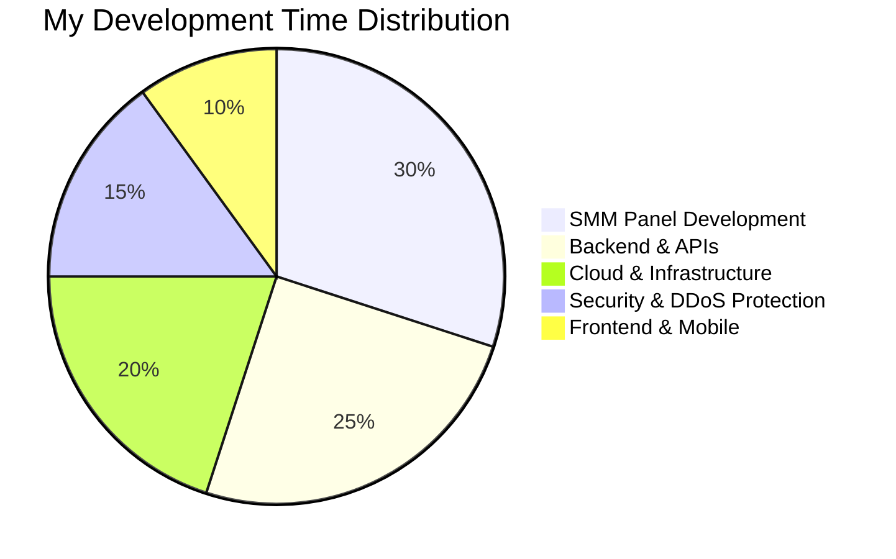

  
  
  
  
  
  
  

---

### 🚀 About Me

- 🔭 Currently working on **[QuickPanel](https://quickpanel.net/)** - En gelişmiş SMM Panel yazılımı
- 🌱 Learning **Modern Frameworks, Cloud Architecture & Microservices**
- 👨‍💻 All projects available at **[GitHub](https://github.com/fastuptime?tab=repositories)**
- 💬 Ask me about **Node.js, TypeScript, Go, Rust, C#, MongoDB, Redis, Multi-Tenant Architecture, SMM Panels**
- ⚡ Fun fact: **I love automating everything & building scalable systems!**
- 🎯 2024 Goals: **Contributing more to Open Source projects & Advanced SMM Solutions**

 

---

## 🛠️ Tech Arsenal

### 🌐 Frontend

### ⚙️ Backend

### 🗄️ Databases & Caching

### ☁️ Cloud & Hosting

### 🔧 Tools & Development

### 🛡️ Security & DDoS Protection

### 🎛️ Control Panels & Management

### 🏢 Enterprise Solutions

---

## 🎯 Current Focus: QuickPanel Development

  
  ### 🚀 **QuickPanel - En Gelişmiş SMM Panel Yazılımı**
  
  
  
  **Currently developing the most advanced SMM Panel software with:**
  
  ✨ **Modern Architecture** | 🔄 **Real-time Processing** | 🛡️ **Advanced Security**
  
  🚀 **High Performance** | 📊 **Analytics Dashboard** | 🌐 **Multi-language Support**
  

---

## 📊 GitHub Analytics

  
  

  

  

---

## 🏆 GitHub Achievements

  

---

## 🎵 Now Playing

  

---

## 🌐 Connect With Me

  
  
  
  
  
  
  
   
  
  
  
  
  
  

---

## 🎯 Development Focus Areas

---

## 💝 Support My Work

  
  
  
  
  **Your support helps me create more awesome open-source projects! 🚀**
  

---

## 🎁 Special Offer

  
  
  
  ### 🚀 Get $200 Free Credit on DigitalOcean for 60 Days!
  
  
  
  Perfect for hosting your next big project! 💻
  

---

  
  
  
  ### 💭 Quote of the Day
  
  
  
  ---
  
  **"Code is like humor. When you have to explain it, it's bad."** – Cory House 💻✨
  
  
  
  © 2024 FastUpTime - Crafted with ❤️ and lots of ☕
  

